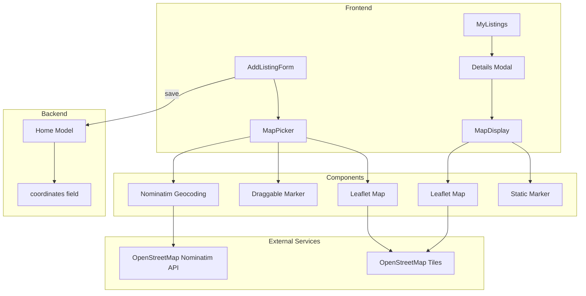
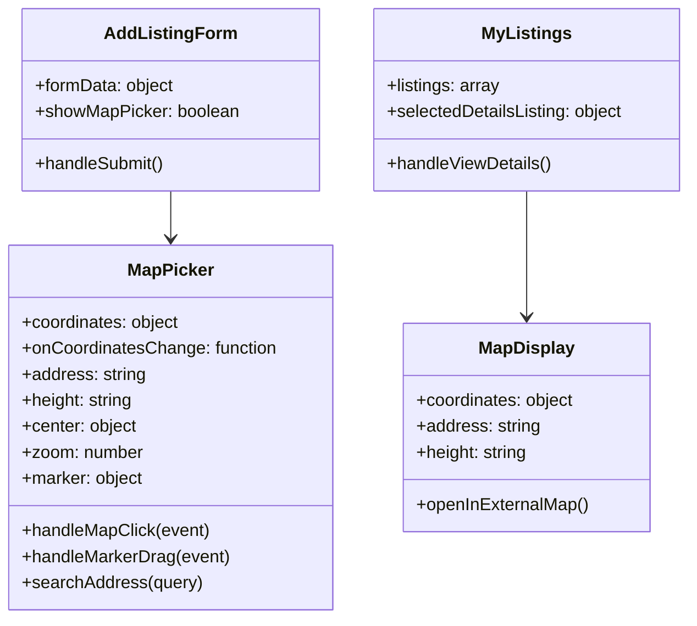

# OpenStreetMap Integration Plan for Landlord Listing Page

## Overview

This plan outlines the implementation of OpenStreetMap integration for the landlord's listing page in the Kejani Homes application. The integration will allow landlords to select property locations on a map when creating/editing listings, and display the location when viewing listing details.

## Current State Analysis

### Existing Infrastructure
- **Backend**: The [`Home.js`](backend/models/Home.js:76) model already supports coordinates with `lat` and `lng` fields
- **Frontend Form**: The [`AddListingForm.jsx`](frontend/src/components/AddListingForm.jsx:15) has:
  - `coordinates` state in formData
  - A placeholder map picker section (lines 368-377)
  - `showMapPicker` toggle state
- **Listing Display**: The [`MyListings.jsx`](frontend/src/pages/landlord/MyListings.jsx:43) receives coordinates but doesn't display them on a map

### Missing Components
- No map library installed (need `leaflet` and `react-leaflet`)
- No actual map component implementation
- No Leaflet CSS imports

## Technology Choice

### Leaflet + React-Leaflet

**Why Leaflet?**
- Open source and free (no API key required)
- Lightweight (~42KB gzipped)
- Excellent OpenStreetMap support
- Large ecosystem and community
- Works well with React via `react-leaflet`

**Alternatives Considered:**
- **Google Maps**: Requires API key, has usage limits, not free
- **Mapbox**: Requires API key, has usage limits
- **OpenLayers**: Heavier, more complex for simple use cases

## Implementation Plan

### Phase 1: Install Dependencies

```bash
cd frontend
npm install leaflet react-leaflet
```

**Packages:**
- `leaflet`: Core mapping library
- `react-leaflet`: React components for Leaflet

### Phase 2: Create Map Components

#### 2.1 MapPicker Component

**Location:** `frontend/src/components/MapPicker.jsx`

**Purpose:** Allow landlords to select a location on the map when creating/editing listings

**Features:**
- Interactive map with click-to-select functionality
- Draggable marker for fine-tuning location
- Search/geocoding integration using Nominatim (OpenStreetMap's free geocoding)
- Default center on Nairobi, Kenya (-1.2921, 36.8219)
- Display current coordinates
- Map controls: zoom, reset view

**Props:**
```jsx
interface MapPickerProps {
  coordinates: { lat: number; lng: number };
  onCoordinatesChange: (coords: { lat: number; lng: number }) => void;
  address?: string;  // For geocoding/search
  height?: string;    // Default: 300px
}
```

#### 2.2 MapDisplay Component

**Location:** `frontend/src/components/MapDisplay.jsx`

**Purpose:** Display listing location in read-only mode (for listing details modal)

**Features:**
- Static marker at listing location
- Click to open in external map (Google Maps, OpenStreetMap)
- Compact view for modal display

**Props:**
```jsx
interface MapDisplayProps {
  coordinates: { lat: number; lng: number };
  address?: string;
  height?: string;    // Default: 200px
}
```

### Phase 3: Integration

#### 3.1 Add Leaflet CSS

**File:** `frontend/src/index.css` or `frontend/src/main.jsx`

Add import at the top:
```css
@import 'leaflet/dist/leaflet.css';
```

Or in main.jsx:
```jsx
import 'leaflet/dist/leaflet.css';
```

#### 3.2 Update AddListingForm

**File:** `frontend/src/components/AddListingForm.jsx`

**Changes:**
1. Import MapPicker component
2. Replace placeholder (lines 368-377) with actual MapPicker
3. Pass coordinates and handle changes
4. Add geocoding: when address changes, optionally suggest coordinates

**Code Changes:**
```jsx
// Import
import MapPicker from './MapPicker'

// Replace placeholder with:
{showMapPicker && (
  <MapPicker
    coordinates={formData.coordinates}
    onCoordinatesChange={(coords) => 
      setFormData(prev => ({ 
        ...prev, 
        coordinates: coords 
      }))
    }
    address={formData.location}
    height="300px"
  />
)}
```

#### 3.3 Update MyListings Details Modal

**File:** `frontend/src/pages/landlord/MyListings.jsx`

**Changes:**
1. Import MapDisplay component
2. Add map display in the details modal (after location section, around line 284)
3. Only show map if coordinates are valid

**Code Changes:**
```jsx
// Import
import MapDisplay from '../../components/MapDisplay'

// Add after location display section:
{selectedDetailsListing.coordinates && 
  selectedDetailsListing.coordinates.lat !== 0 && (
  <div>
    <h4 className="font-semibold text-dark dark:text-light mb-3">Location on Map</h4>
    <MapDisplay
      coordinates={selectedDetailsListing.coordinates}
      address={selectedDetailsListing.location}
      height="200px"
    />
  </div>
)}
```

### Phase 4: Fix Leaflet Marker Icons

Leaflet marker icons may not display correctly with bundlers like Vite. Need to configure icon paths:

**File:** `frontend/src/components/MapPicker.jsx` (and MapDisplay.jsx)

```jsx
import L from 'leaflet'
import icon from 'leaflet/dist/images/marker-icon.png'
import iconShadow from 'leaflet/dist/images/marker-shadow.png'

// Fix default marker icon
let DefaultIcon = L.icon({
  iconUrl: icon,
  shadowUrl: iconShadow,
  iconSize: [25, 41],
  iconAnchor: [12, 41],
})

L.Marker.prototype.options.icon = DefaultIcon
```

## Architecture Diagram



## Component Structure



## File Changes Summary

| File | Action | Description |
|------|--------|-------------|
| `frontend/package.json` | Modify | Add leaflet and react-leaflet dependencies |
| `frontend/src/index.css` | Modify | Add Leaflet CSS import |
| `frontend/src/components/MapPicker.jsx` | Create | New interactive map picker component |
| `frontend/src/components/MapDisplay.jsx` | Create | New read-only map display component |
| `frontend/src/components/AddListingForm.jsx` | Modify | Replace placeholder with MapPicker |
| `frontend/src/pages/landlord/MyListings.jsx` | Modify | Add MapDisplay to details modal |

## Default Configuration

```jsx
// Default map center: Nairobi, Kenya
const DEFAULT_CENTER = {
  lat: -1.2921,
  lng: 36.8219
}

// Default zoom level
const DEFAULT_ZOOM = 13

// Map tile layer (OpenStreetMap)
const TILE_LAYER = 'https://{s}.tile.openstreetmap.org/{z}/{x}/{y}.png'

// Attribution
const ATTRIBUTION = '&copy; <a href="https://www.openstreetmap.org/copyright">OpenStreetMap</a> contributors'
```

## Geocoding Integration (Optional Enhancement)

For address-to-coordinate conversion, use Nominatim (OpenStreetMap's free geocoding API):

```jsx
const geocodeAddress = async (address) => {
  const response = await fetch(
    `https://nominatim.openstreetmap.org/search?format=json&q=${encodeURIComponent(address)}&limit=1`
  )
  const data = await response.json()
  if (data && data[0]) {
    return {
      lat: parseFloat(data[0].lat),
      lng: parseFloat(data[0].lon)
    }
  }
  return null
}
```

**Note:** Nominatim has rate limits (1 request/second). For production, consider:
- Caching results
- Using a dedicated geocoding service
- Implementing debouncing

## Testing Checklist

- [ ] Map displays correctly in AddListingForm
- [ ] Marker can be placed by clicking on map
- [ ] Marker can be dragged to adjust position
- [ ] Coordinates update in form state
- [ ] Map displays in listing details modal
- [ ] Map shows correct location from saved coordinates
- [ ] Map tiles load properly
- [ ] Marker icons display correctly
- [ ] Dark mode compatibility
- [ ] Mobile responsiveness
- [ ] No console errors

## Potential Issues and Solutions

| Issue | Solution |
|-------|----------|
| Marker icons not showing | Configure icon paths explicitly |
| Map not rendering in modal | Ensure map container has defined height |
| Tiles not loading | Check network, verify tile URL |
| Dark mode styling | Add custom CSS for dark map theme |
| Mobile touch events | Ensure Leaflet's touch handlers are enabled |
| Modal animation issues | Use `whenReady` callback before initializing map |

## Next Steps

1. Review and approve this plan
2. Switch to Code mode for implementation
3. Install dependencies
4. Create components
5. Integrate into existing forms
6. Test functionality